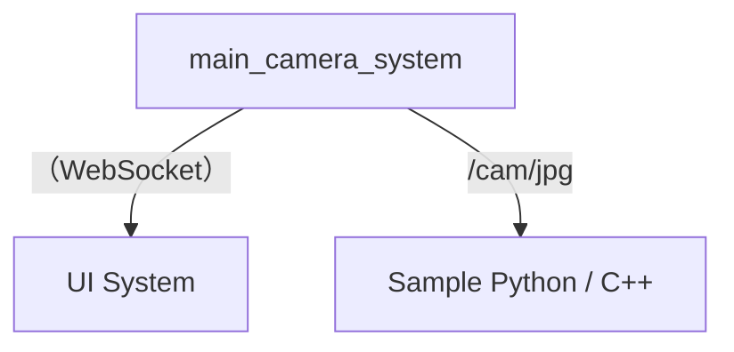

# アタッカー用アプリケーション

- 本アプリケーションはLinuxを対象としています
  - Ubuntu 24.04 LTSで動作を確認しています

## アプリ一覧

### main_camera_system

- Webカメラの映像を、Zenoh query と WebSocket で配信します

### ui_system

- データをUIに描画し、GUIで表示します

## Zenoh Query

### 一覧

| アプリ名           | トピック名 | データ形式 |
| ------------------ | ---------- | ---------- |
| main_camera_system | /cam/jpg   | JPEG       |
| main_camera_system | /cam/raw   | RGB 24 bit |

### ネットワーク

