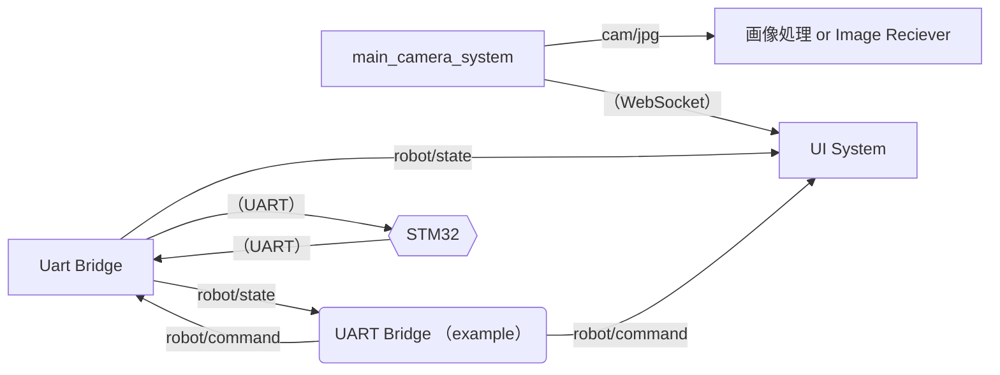

# アタッカー用アプリケーション

- 本アプリケーションはLinuxを対象としています
  - Ubuntu 24.04 LTSで動作を確認しています

## 設定ファイル

本アプリケーション群は、`$XDG_CONFIG_HOME/` または `~/.config/` 以下 `roboapp/config.toml` に設定ファイルを配置します。

設定ファイルの書式があっているかは、`configurator` アプリで確認できます。
正常終了したら、書式はあっています。

```bash
cd configurator
uv run python3 check.py
```

書式や設定内容は、[サンプルファイル](./configurator/test/resources/config_sample.toml)や、[設定の実装](./configurator/src/configurator/config.py)、各アプリケーションの実装・ドキュメントを参考にしてください。

## アプリ一覧

### main_camera_system

- Webカメラの映像を、Zenoh query と WebSocket で配信します

### Image Reciever Sample CPP / Python

- main camera system で出力した画像を受信するサンプルです

### ui_system

- データをUIに描画し、GUIで表示します

### uart_bridge

- マイコンとUART通信を行い、Zenoh queryでデータを配信します

## Zenoh Query

### 一覧

| アプリ名           | トピック名      | データ形式   |
| ------------------ | --------------- | ------------ |
| main_camera_system | cam/jpg         | JPEG         |
| main_camera_system | cam/switch      | int or None  |
| uart_bridge        | robot/state/*   | RobotState   |
| uart_bridge        | robot/command/* | RobotCommand |

### ネットワーク


