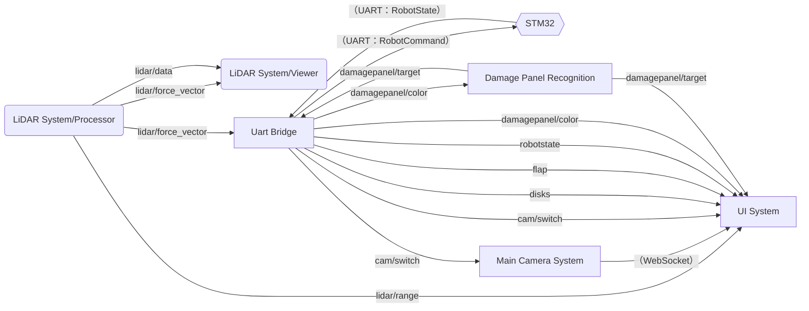

# アタッカー用アプリケーション

- 本アプリケーションはLinuxを対象としています
  - Ubuntu 24.04 LTSで動作を確認しています

## 初期設定

1. miseのインストール

- 本アプリケーションの設定には、[mise](https://mise.jdx.dev)を用いています
  - [インストールドキュメント](https://mise.jdx.dev/getting-started.html)を基に、miseをインストールしてください
  - Activate miseを行うと、いくつかのパスを上書きするため、必要に応じて選択してください。
  - 都度Activateする運用で問題ありません

1. 依存関係のインストール

- 以下のコマンドを実行します

- ```bash
    mise i
    mise deps
    ```

書式や設定内容は、各アプリケーションの実装・ドキュメントを参考にしてください。

## アプリ一覧

### main_camera_system

- Webカメラの映像を、Zenoh query と WebSocket で配信します

### Image Reciever Sample CPP / Python

- main camera system で出力した画像を受信するサンプルです

### lidar_system

- LiDARを用いて、障害物回避のための力ベクトルを算出します

### ui_system

- データをUIに描画し、GUIで表示します

### uart_bridge

- マイコンとUART通信を行い、Zenoh queryでデータを配信します

## Zenoh Query

### 一覧

| 送信元アプリ名         | 出力トピック名     | データ形式               |
| ---------------------- | ------------------ | ------------------------ |
| main_camera_system     | cam/jpg            | JPEG                     |
| uart_bridge            | cam/switch         | CameraSwitchMessage      |
| uart_bridge            | disks              | DisksMessage             |
| uart_bridge            | flap               | FlapMessage              |
| uart_bridge            | robotstate         | RobotStateMessage        |
| uart_bridge            | damagepanel/color  | DamagePanelColorMessage  |
| damaage_panel_recog    | damagepanel/target | DamagePanelTargetMessage |
| lidar_system/processor | lidar/data         | LiDARData                |
| lidar_system/processor | lidar/range        | LiDARRangeMessage        |
| lidar_system/processor | lidar/force_vector | LiDARVectorMessage       |

### ネットワーク


```mermaid
flowchart LR

    LP(LiDAR System/Processor)
    LV(LiDAR System/Viewer)
    M{{STM32}}
    C[Main Camera System]
    U[Uart Bridge]
    T[UI System]
    D[Damage Panel Recognition]

    LP -- lidar/force_vector --> U
    LP -- lidar/force_vector --> LV
    LP -- lidar/data --> LV
    LP -- lidar/range --> T
    C -- （WebSocket）--> T
    U -- cam/switch --> T
    U -- cam/switch --> C
    U -- disks --> T
    U -- flap --> T
    U -- robotstate --> T
    U -- （UART：RobotCommand） --> M
    M -- （UART：RobotState） --> U
    U -- damagepanel/color --> D
    U -- damagepanel/color --> T
    D -- damagepanel/target --> U
    D -- damagepanel/target --> T
```
